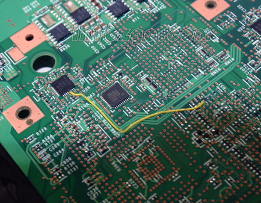

# 达夫设备
```
#include <iostream>

void fun(int i) {
    switch (i) {
        case 0:
            for(; i <= 2; ++i) {
                std::cout << "world, ";
        case 2:
                std::cout << "bye.\n";
                return;
        case 1:
                std::cout << "hello ";
            }
    }
}

int main() {
    int i = 0;
    fun(i);
    
    i = 1;
    fun(i);
    
    i = 2;
    fun(i);
    
    i = 3;
    fun(i);

    return 0;
}
```
输出
```
world, bye.
hello, world, bye.
bye.
```
`switch-case`语法应该是`C`语言中的基础，`goto`语法也是`C`语言中的基础。`goto`后面衔接的是`label`，而`switch`中的`case`也是一种`label`，这意味着`case`语句可以插入其他语句中，如for循环，这就如同电路板中的飞线，有点反直觉。



# 奇怪的知识增加了
当`i=0`时，满足`case 0`，然后进入`for`循环，`0 < 2`成立，输出`world, `，在`for`循环中`case 2:`如同标号，被忽略，进而输出`bye.`，`return`退出。

当`i=1`时，满足`case 1`，输出`hello `，同时也经过飞线，直接跳进了`for`循环中，`1 < 2`成立，`++i`，`i=2`，输出`world, `，`case 2:`如同标号，被忽略，进而输出`bye.`，`return`退出。

当`i=2`时，满足`case 2`，输出`bye.`，`return`退出。

当`i=3`时，不满足任何`case`。

这种反常的特性有一个著名的应用就是达夫设备（Duff’s device），主要用于循环展开以优化性能。
```
#include <iostream>
// 使用 case 来完成 duff's device
void private_memcpy(char *to, const char *from, size_t count) {
    size_t n = (count + 7) / 8;
    #define COPY *to = *from;
    #define ADVANCE to++, from++;
    switch (count % 8) {
    case 0: do { COPY ADVANCE
    case 7:      COPY ADVANCE
    case 6:      COPY ADVANCE
    case 5:      COPY ADVANCE
    case 4:      COPY ADVANCE
    case 3:      COPY ADVANCE
    case 2:      COPY ADVANCE
    case 1:      COPY ADVANCE
            } while (--n > 0);
    }
    #undef COPY
    #undef ADVANCE
}

int main() {
    const char from[] = "jintianxiaomidaobilema";
    char to[sizeof from];
    private_memcpy(to, from, sizeof from);
    std::cout << to << std::endl;
    return 0;
}
```

Asio的[无栈协程](https://github.com/chriskohlhoff/asio/blob/1408e2895c94c8e254e9e8ddd66ba083777f0dc2/asio/include/asio/coroutine.hpp)也是基于飞线实现的。
